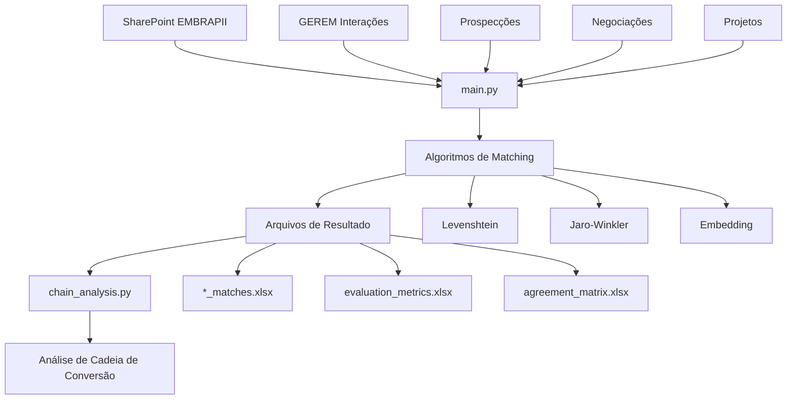
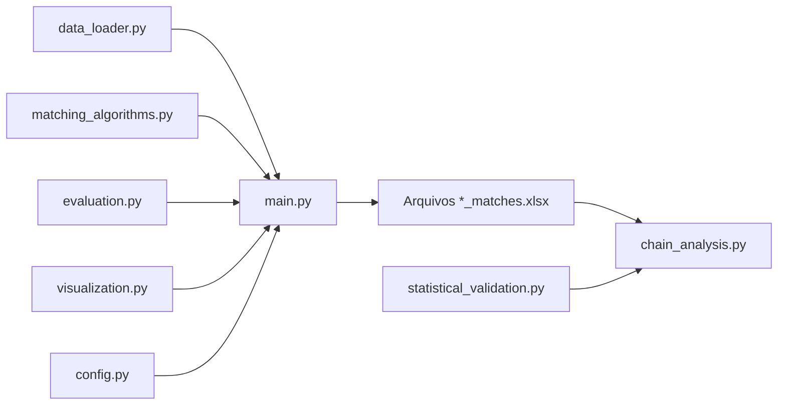

# EMBRAPII Matching Algorithm Evaluation

Este projeto implementa uma avaliação comparativa de algoritmos de matching para relacionar dados de interações GEREM com prospecções, negociações e projetos. O sistema foi projetado para permitir testes fáceis com diferentes planilhas e avaliar qual algoritmo produz os melhores resultados.

## Algoritmos Implementados

O projeto implementa três algoritmos de matching:

1. **Levenshtein Distance otimizado**: Calcula o número mínimo de edições necessárias entre duas strings. Utilizamos `python-Levenshtein`, que é mais rápido que `fuzzywuzzy`.

2. **Jaro-Winkler**: Favorece similaridades no início da string, ideal para nomes comerciais. Implementado com `jellyfish.jaro_winkler_similarity`.

3. **Embedding de Texto (via IA)**: Transforma os nomes em vetores semânticos e calcula distância vetorial. Utilizamos `sentence-transformers`, ideal para casos mais complexos.

## Estrutura do Projeto

```
embrapii-matching/
├── data/                 # Diretório para dados locais
├── temp/                 # Arquivos temporários
├── results/              # Resultados de matching
│   ├── gerem_prospecoes/ # Resultados de matching GEREM-Prospecções
│   ├── gerem_negociacoes/ # Resultados de matching GEREM-Negociações
│   └── gerem_projetos/   # Resultados de matching GEREM-Projetos
├── logs/                 # Logs de execução
├── evaluation/           # Resultados de avaliação
├── visualization/        # Visualizações geradas
├── data_loader.py        # Carregador de dados do SharePoint
├── matching_algorithms.py # Implementação dos algoritmos
├── evaluation.py         # Métricas de avaliação
├── visualization.py      # Visualização de resultados
├── config.py             # Configurações do projeto
├── main.py               # Script principal
├── chain_analysis.py     # Análise da cadeia de conversão
├── requirements.txt      # Dependências do projeto
└── README.md             # Este arquivo
```

## Fluxo de Dados e Análise de Cadeia

### 📊 Fontes de Dados

Os dados para análise são obtidos de **duas fontes principais**:

#### 1. **SharePoint da EMBRAPII** (Fonte Principal)
- **Local**: `https://embrapii.sharepoint.com/sites/GEPES`
- **Planilhas utilizadas**:
  - 📋 **GEREM Interações**: `General/Lucas Pinheiro/scriptGerem/apuracao_resultados_2024.xlsx`
  - 🎯 **Prospecções**: `DWPII/srinfo/prospeccao_prospeccao.xlsx`
  - 🤝 **Negociações (Empresas)**: `DWPII/srinfo/negociacoes_empresas.xlsx`
  - 🤝 **Negociações (Datas)**: `DWPII/srinfo/negociacoes_negociacoes.xlsx`
  - 🚀 **Projetos**: `DWPII/srinfo/portfolio.xlsx`
  - 🏢 **Info Empresas**: `DWPII/srinfo/info_empresas.xlsx`

#### 2. **Arquivos Locais** (Alternativo)
- Diretório `data/` para arquivos locais quando não há acesso ao SharePoint

### 🔄 Fluxo Completo de Processamento



### 📁 Estrutura de Arquivos de Resultado

O sistema gera uma estrutura hierárquica de resultados:

```
results/
├── gerem_prospecoes/
│   └── [YYYYMMDD_HHMMSS]/
│       ├── levenshtein_matches.xlsx      # ✅ Usado pelo chain_analysis
│       ├── jaro_winkler_matches.xlsx     # ✅ Usado pelo chain_analysis
│       ├── embedding_matches.xlsx        # ✅ Usado pelo chain_analysis
│       ├── evaluation_metrics.xlsx       # Métricas de avaliação
│       ├── agreement_matrix.xlsx         # Concordância entre algoritmos
│       ├── best_matches.xlsx            # Melhores matches
│       ├── gerem_input.xlsx             # Dados de entrada
│       └── prospecoes_input.xlsx        # Dados de entrada
├── gerem_negociacoes/
│   └── [YYYYMMDD_HHMMSS]/
│       └── ... (mesma estrutura)
└── gerem_projetos/
    └── [YYYYMMDD_HHMMSS]/
        └── ... (mesma estrutura)
```

### 🔗 Construção Dinâmica de Caminhos

O `chain_analysis.py` localiza automaticamente os arquivos mais recentes:

1. **Localização por Timestamp**: Ordena as pastas por data/hora e seleciona a mais recente
2. **Carregamento Multi-Algoritmo**: Para cada tipo de matching, carrega os 3 algoritmos
3. **Estrutura de Resultado**: `results/{tipo_matching}/{timestamp}/{algoritmo}_matches.xlsx`

**Exemplo de caminho construído**:
```
results/gerem_prospecoes/20250603_095044/levenshtein_matches.xlsx
```

### 📈 Estrutura dos Arquivos de Matches

Cada arquivo `*_matches.xlsx` contém:

| Coluna | Descrição |
|--------|-----------|
| `source_id` | ID da interação GEREM |
| `target_id` | ID da prospecção/negociação/projeto |
| `source_name` | Nome da empresa na interação GEREM |
| `target_name` | Nome da empresa na base de destino |
| `similarity` | Pontuação de similaridade (0-1) |
| `source_date` | Data da interação GEREM |
| `target_date` | Data da prospecção/negociação/projeto |

## Análise da Cadeia de Conversão

### 🔬 Funcionalidades do chain_analysis.py

O `chain_analysis.py` é uma **interface web interativa** construída com Streamlit que permite:

1. **📊 Análise de Cadeia Completa**: GEREM → Prospecções → Negociações → Projetos
2. **⚙️ Configuração Dinâmica**: Ajuste de thresholds e algoritmos em tempo real
3. **📈 Visualizações Interativas**: Funis, gráficos e métricas de conversão
4. **💾 Exportação**: Resultados em JSON e Excel
5. **🔄 Atualização Automática**: Recálculo automático quando filtros mudam

### 🚀 Como Usar o Sistema Completo

#### **Passo 1: Executar o Matching Principal**

Primeiro, execute o `main.py` para gerar os arquivos de resultado:

```bash
# Executar todos os tipos de matching
python main.py

# Ou executar tipos específicos
python main.py --mode prospecoes
python main.py --mode negociacoes
python main.py --mode projetos
```

**⚠️ Importante**: O `chain_analysis.py` depende dos arquivos gerados pelo `main.py`

#### **Passo 2: Executar a Análise de Cadeia**

Após ter os resultados, execute a interface de análise:

```bash
streamlit run chain_analysis.py
```

Isso abrirá uma interface web no seu navegador (geralmente `http://localhost:8501`)

### 🎛️ Interface do Chain Analysis

#### **Configurações Disponíveis**:

1. **🎯 Thresholds de Similaridade**:
   - Prospecções: 0.0 - 1.0 (padrão: 0.7)
   - Negociações: 0.0 - 1.0 (padrão: 0.7)
   - Projetos: 0.0 - 1.0 (padrão: 0.7)

2. **🤖 Seleção de Algoritmos**:
   - Levenshtein (padrão)
   - Jaro-Winkler
   - Embedding

3. **🔄 Atualização**:
   - Automática: Recalcula quando parâmetros mudam
   - Manual: Botão "Executar Análise"

#### **Métricas Principais**:

- **Total de Interações**: Número de interações GEREM únicas
- **Interações → Projetos**: Quantas interações resultaram em projetos
- **Taxa de Conversão**: Percentual de conversão final
- **Nível de Confiança**: Baseado na média de similaridades
- **Cadeia Completa**: Interações que passaram por todas as etapas

#### **Visualizações Geradas**:

1. **📊 Funil de Conversão**: Mostra o afunilamento por etapa
2. **📈 Conversões por Etapa**: Gráfico de barras comparativo
3. **🎯 Gauge de Taxa de Conversão**: Indicador visual da performance
4. **📋 Tabela de Algoritmos**: Detalhamento por configuração

### 💾 Exportação de Resultados

#### **JSON (Análise Completa)**:
```bash
# Gera arquivo: chain_analysis_YYYYMMDD_HHMMSS.json
```
Contém:
- Configuração utilizada
- Resultados completos
- Resumo executivo
- Timestamp da análise

#### **Excel (Detalhes)**:
```bash
# Gera arquivo: chain_details_YYYYMMDD_HHMMSS.xlsx
```
Contém múltiplas abas:
- **Resumo**: Métricas principais
- **Prospecções**: Matches detalhados
- **Negociações**: Matches detalhados
- **Projetos**: Matches detalhados

### 🔄 Fluxo Recomendado de Uso

1. **Executar Matching Inicial**:
   ```bash
   python main.py --mode all
   ```

2. **Verificar Resultados Gerados**:
   ```bash
   ls -la results/*/
   ```

3. **Executar Análise de Cadeia**:
   ```bash
   streamlit run chain_analysis.py
   ```

4. **Ajustar Parâmetros na Interface**:
   - Configurar thresholds apropriados
   - Selecionar melhores algoritmos
   - Analisar métricas de conversão

5. **Exportar Resultados Finais**:
   - JSON para análise técnica
   - Excel para relatórios executivos

### ⚡ Dependências entre Scripts



**Ordem de Execução Obrigatória**:
1. `main.py` (gera arquivos de resultado)
2. `chain_analysis.py` (analisa resultados gerados)

## Requisitos

- Python 3.8 ou superior
- Bibliotecas listadas em `requirements.txt`

## Instalação

1. Clone o repositório:

```bash
git clone https://github.com/seu-usuario/embrapii-matching.git
cd embrapii-matching
```

2. Crie um ambiente virtual:

```bash
python -m venv venv
```

3. Ative o ambiente virtual:

**Windows:**
```bash
venv\Scripts\activate
```

**Linux/Mac:**
```bash
source venv/bin/activate
```

4. Instale as dependências:

```bash
pip install -r requirements.txt
```

5. Configure suas credenciais do SharePoint:

Crie um arquivo `.env` na raiz do projeto com o seguinte conteúdo:

```
sharepoint_email=seu.email@embrapii.org.br
sharepoint_password=sua_senha_segura
sharepoint_url_site=https://embrapii.sharepoint.com/sites/GEPES
```

## Uso

### Executando todos os testes de matching

```bash
python main.py
```

### Executando apenas um tipo de matching

```bash
python main.py --mode prospecoes  # Apenas matching GEREM-Prospecções
python main.py --mode negociacoes  # Apenas matching GEREM-Negociações
python main.py --mode projetos  # Apenas matching GEREM-Projetos
```

### Definindo credenciais na linha de comando

```bash
python main.py --email seu.email@embrapii.org.br --password sua_senha
```

### Desativando visualizações

```bash
python main.py --no-vis
```

### Usando um arquivo de configuração personalizado

```bash
python main.py --config minha_configuracao.yaml
```

## Configuração

O arquivo `config.py` contém as configurações padrão. Você pode sobrescrever essas configurações criando um arquivo YAML personalizado.

Exemplo de configuração YAML:

```yaml
sharepoint:
  site: https://embrapii.sharepoint.com/sites/GEPES
  data_path:
    gerem_interacoes: General/Lucas Pinheiro/scriptGerem/apuracao_resultados_2024.xlsx
    prospeccoes: DWPII/srinfo/prospeccao_prospeccao.xlsx

matching:
  algorithms:
    levenshtein:
      enabled: true
      threshold: 0.75
    jaro_winkler:
      enabled: true
      threshold: 0.85
    embedding:
      enabled: true
      threshold: 0.65
      model: paraphrase-multilingual-MiniLM-L12-v2
```

## Resultados

Após a execução, os resultados são salvos nos seguintes diretórios:

- `results/gerem_prospecoes/`: Resultados de matching GEREM-Prospecções
- `results/gerem_negociacoes/`: Resultados de matching GEREM-Negociações
- `results/gerem_projetos/`: Resultados de matching GEREM-Projetos

Cada diretório contém:

- Arquivos Excel com os matches encontrados por cada algoritmo
- Métricas de avaliação
- Matriz de concordância entre algoritmos
- Resultados de comparação de thresholds
- Visualizações (gráficos)
- O melhor resultado de matching baseado no critério escolhido

## Visualizações

As visualizações incluem:

- Contagem de matches por algoritmo
- Distribuição de scores de similaridade
- Mapa de calor de concordância entre algoritmos
- Exemplos de matches
- Comparação de thresholds
- Rede comparativa de matches

## Avaliação

O sistema avalia os algoritmos com base em:

- Número total de matches
- Número de registros únicos de origem com match
- Número de registros únicos de destino com match
- Média de similaridade
- Concordância entre algoritmos

O melhor algoritmo é selecionado com base no critério configurado (padrão: `match_count`).

## Configurações Adicionais

### 🔧 Variáveis de Ambiente

Crie um arquivo `.env` na raiz do projeto:

```env
# Credenciais SharePoint
sharepoint_email=seu.email@embrapii.org.br
sharepoint_password=sua_senha_segura
sharepoint_url_site=https://embrapii.sharepoint.com/sites/GEPES

# Configurações opcionais
OPENAI_API_KEY=sua_chave_openai  # Para análises avançadas (opcional)
```

### ⚙️ Configuração dos Caminhos SharePoint

Os caminhos das planilhas podem ser alterados no `config.py`:

```python
'data_path': {
    'gerem_interacoes': 'General/Lucas Pinheiro/scriptGerem/apuracao_resultados_2024.xlsx',
    'prospeccoes': 'DWPII/srinfo/prospeccao_prospeccao.xlsx',
    'negociacoes': 'DWPII/srinfo/negociacoes_empresas.xlsx',
    'negociacoes_negociacoes': 'DWPII/srinfo/negociacoes_negociacoes.xlsx',
    'projetos': 'DWPII/srinfo/portfolio.xlsx',
    'info_empresas': 'DWPII/srinfo/info_empresas.xlsx'
}
```

### 🎯 Configuração de Thresholds Padrão

Para alterar thresholds padrão, edite o `config.py`:

```python
'algorithms': {
    'levenshtein': {
        'enabled': True,
        'threshold': 0.75  # Ajuste conforme necessário
    },
    'jaro_winkler': {
        'enabled': True,
        'threshold': 0.85  # Ajuste conforme necessário
    },
    'embedding': {
        'enabled': True,
        'threshold': 0.65,  # Ajuste conforme necessário
        'model': 'paraphrase-multilingual-MiniLM-L12-v2'
    }
}
```

## Troubleshooting

### ❌ Problemas Comuns

#### **1. Erro de Autenticação SharePoint**
```
Error: Authentication failed
```
**Solução**:
- Verifique as credenciais no arquivo `.env`
- Confirme acesso ao site SharePoint
- Teste login manual no navegador

#### **2. Arquivo não encontrado no SharePoint**
```
Error: File not found: [caminho_arquivo]
```
**Solução**:
- Verifique se os caminhos em `config.py` estão corretos
- Confirme se os arquivos existem no SharePoint
- Verifique permissões de acesso

#### **3. Chain Analysis não carrega dados**
```
Nenhuma pasta de resultados encontrada
```
**Solução**:
- Execute primeiro `python main.py` para gerar resultados
- Verifique se existe diretório `results/`
- Confirme se há arquivos `*_matches.xlsx` gerados

#### **4. Erro de memória com embeddings**
```
OutOfMemoryError
```
**Solução**:
- Reduza tamanho dos datasets
- Use modelo embedding menor
- Aumente RAM disponível ou use GPU

#### **5. Streamlit não abre**
```
streamlit: command not found
```
**Solução**:
```bash
pip install streamlit
# ou
pip install -r requirements.txt
```

### 🔍 Verificação de Instalação

Execute este teste para verificar se tudo está funcionando:

```bash
# 1. Testar importações
python -c "import pandas, streamlit, plotly; print('✅ Bibliotecas OK')"

# 2. Testar configuração
python -c "from config import load_config; print('✅ Config OK')"

# 3. Testar data loader
python -c "from data_loader import DataLoader; print('✅ DataLoader OK')"

# 4. Verificar estrutura de diretórios
ls -la results/ 2>/dev/null && echo "✅ Diretório results OK" || echo "❌ Crie diretório results"
```

### 📊 Performance e Otimização

#### **Para Grandes Datasets**:

1. **Reduza Thresholds de Teste**:
```python
'run_threshold_comparison': False  # Desabilita comparação de thresholds
```

2. **Use Processamento em Lote**:
```python
'batch_size': 1000  # Processa em lotes menores
```

3. **Desabilite Visualizações Pesadas**:
```python
'generate_visualizations': False  # Para execução mais rápida
```

### 🆘 Suporte e Logs

#### **Localização de Logs**:
- **Execução Principal**: `logs/matching.log`
- **Chain Analysis**: Interface Streamlit mostra erros na tela
- **Configuração**: Verificar `config.json` nos diretórios de resultado

#### **Logs Detalhados**:
```bash
# Executar com logs verbosos
python main.py --log-level DEBUG

# Ver logs em tempo real
tail -f logs/matching.log
```

## Exemplo Prático de Uso

### 🎯 Cenário: Análise Completa da Cadeia de Conversão

Este exemplo mostra como usar o sistema completo para analisar a cadeia de conversão GEREM.

#### **Passo 1: Preparação do Ambiente**

```bash
# 1. Clonar e configurar
git clone [repositorio]
cd embrapii-matching

# 2. Criar ambiente virtual
python -m venv venv
source venv/bin/activate  # Linux/Mac
# ou venv\Scripts\activate  # Windows

# 3. Instalar dependências
pip install -r requirements.txt

# 4. Configurar credenciais
echo "sharepoint_email=seu.email@embrapii.org.br" > .env
echo "sharepoint_password=sua_senha" >> .env
echo "sharepoint_url_site=https://embrapii.sharepoint.com/sites/GEPES" >> .env
```

#### **Passo 2: Executar Matching Inicial**

```bash
# Executar matching completo (todos os tipos)
python main.py --mode all

# Resultado esperado:
# ✅ GEREM to Prospections matching completed. Results in results/gerem_prospecoes/20250603_142030
# ✅ GEREM to Negotiations matching completed. Results in results/gerem_negociacoes/20250603_142045  
# ✅ GEREM to Projects matching completed. Results in results/gerem_projetos/20250603_142100
```

#### **Passo 3: Verificar Arquivos Gerados**

```bash
# Verificar estrutura criada
tree results/
# results/
# ├── gerem_negociacoes/
# │   └── 20250603_142045/
# │       ├── levenshtein_matches.xlsx ✅
# │       ├── jaro_winkler_matches.xlsx ✅
# │       └── embedding_matches.xlsx ✅
# ├── gerem_projetos/
# │   └── 20250603_142100/
# │       └── ... (mesma estrutura)
# └── gerem_prospecoes/
#     └── 20250603_142030/
#         └── ... (mesma estrutura)

# Verificar se há matches encontrados
wc -l results/*/*/levenshtein_matches.xlsx
```

#### **Passo 4: Executar Análise de Cadeia**

```bash
# Iniciar interface Streamlit
streamlit run chain_analysis.py

# Interface abrirá em: http://localhost:8501
```

#### **Passo 5: Configurar Análise na Interface**

Na interface web:

1. **Carregar Dados**: Clique em "🔄 Carregar Dados"
2. **Configurar Thresholds**:
   - Prospecções: 0.75
   - Negociações: 0.70
   - Projetos: 0.65
3. **Selecionar Algoritmos**:
   - Prospecções: Levenshtein
   - Negociações: Jaro-Winkler
   - Projetos: Embedding
4. **Executar**: Clique em "🚀 Executar Análise"

#### **Passo 6: Interpretar Resultados**

**Métricas Esperadas**:
```
📊 Total de Interações: 1,247
🎯 Interações → Projetos: 89 (7.1%)
📈 Taxa de Conversão: 7.1%
🔍 Nível de Confiança: 78% (Alto)
🔗 Cadeia Completa: 23 (1.8%)
```

**Interpretação**:
- **7.1% de conversão**: De cada 100 interações GEREM, 7 resultam em projetos
- **78% de confiança**: Alta qualidade nos matches encontrados
- **1.8% cadeia completa**: Apenas 23 interações passaram por todas as etapas

#### **Passo 7: Otimizar Parâmetros**

**Teste diferentes configurações**:

1. **Threshold mais baixo** (encontrar mais matches):
   - Prospecções: 0.65
   - Negociações: 0.60
   - Projetos: 0.55

2. **Algoritmo diferente** (melhor qualidade):
   - Trocar de Levenshtein para Embedding

3. **Observar mudanças em tempo real** com atualização automática ativada

#### **Passo 8: Exportar Resultados**

```bash
# Na interface, clique em:
# 📊 Exportar Análise (JSON) - para análise técnica
# 📈 Exportar Detalhes (Excel) - para relatórios

# Arquivos gerados:
# chain_analysis_20250603_143000.json
# chain_details_20250603_143000.xlsx
```

#### **Passo 9: Análise Executiva**

**Arquivo Excel gerado contém**:

- **Aba "Resumo"**: Métricas principais para apresentação
- **Aba "Prospecções"**: Lista detalhada de matches GEREM→Prospecções
- **Aba "Negociações"**: Lista detalhada de matches GEREM→Negociações  
- **Aba "Projetos"**: Lista detalhada de matches GEREM→Projetos

**Insights para Relatório**:
```
🎯 CONCLUSÕES:
- Taxa de conversão GEREM→Projetos: 7.1%
- Confiança nos matches: 78% (Alta)
- Oportunidade: 92.9% das interações não viraram projetos
- Recomendação: Melhorar processo de prospecção
```

### 🔄 Fluxo para Atualizações Mensais

```bash
# 1. Atualizar dados (mensalmente)
python main.py --mode all

# 2. Comparar com período anterior  
streamlit run chain_analysis.py

# 3. Usar mesmos parâmetros do período anterior
# 4. Exportar e comparar métricas
# 5. Gerar relatório de evolução
```

### 📊 Cenários de Uso Específicos

#### **Cenário A: Foco em Alta Precisão**
```
Thresholds: 0.85+ em todos
Algoritmo: Embedding 
Objetivo: Poucos matches, mas alta confiança
```

#### **Cenário B: Foco em Abrangência**  
```
Thresholds: 0.55-0.65
Algoritmo: Levenshtein
Objetivo: Máximo de matches possíveis
```

#### **Cenário C: Balanceado**
```
Thresholds: 0.70-0.75
Algoritmo: Jaro-Winkler
Objetivo: Equilíbrio qualidade vs quantidade
```

## Licença

[Especifique a licença do projeto]

## Contato

[Seus dados de contato]